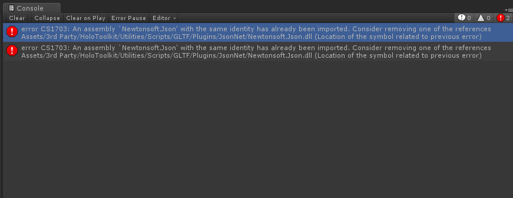
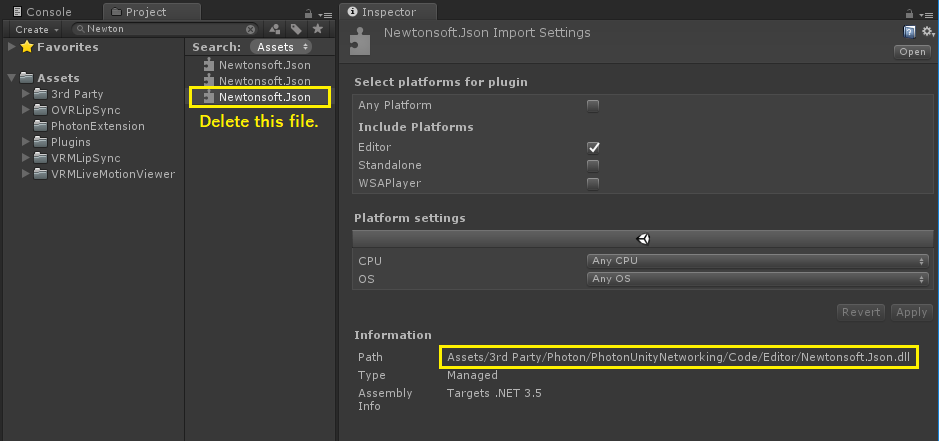
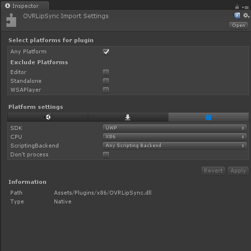
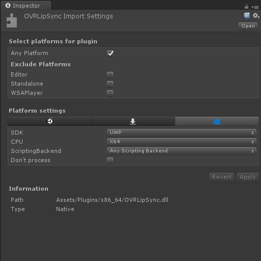

# VRM Live Motion Viewer For HoloLens

[Watch on Youtube](https://www.youtube.com/watch?v=328ZCtTw9UE)


## Tested Environment
- Unity 2017.4.14f1
- Visual Studio 2017
- HoloLens RS5 Preview (OS Build: 17720.1000)

## Third party assets
You need to import the following assets.

- [Photon Voice 2](https://assetstore.unity.com/packages/tools/audio/photon-voice-2-130518)
    - Photon Voice : v2.1.1 (November 21st, 2018)

- [PUN 2](https://assetstore.unity.com/packages/tools/network/pun-2-free-119922)
    - PUN2 : v2.5 (20th November 2018)

- [Oculus Lipsync Unity Plugin 1.16.0](https://developer.oculus.com/downloads/package/oculus-lipsync-unity/1.16.0/)

The following assets are included in this project.
- [UniVRM v0.43](https://github.com/dwango/UniVRM/releases/tag/v0.43)  
Licensed under the MIT License. Copyright (c) DWANGO Co., Ltd.  

- [MixedRealityToolkit-Unity 2017.4.1.0](https://github.com/Microsoft/MixedRealityToolkit-Unity/releases/tag/2017.4.1.0)  
Licensed under the MIT License. Copyright (c) Microsoft Corporation.  

## Settings
### Settings of Photon






### Settings of Oculus Lipsync Unity Plugin 1.16.0
Modify plugin import settings.





Comment out the Start method of OVRLipSyncContext class.
```
    void Start()
    {

        // Add a listener to the OVRMessenger for touch events

        // OVRMessenger.AddListener<OVRTouchpad.TouchEvent>("Touchpad", LocalTouchEventCallback);

    }
``` 

## License
- [MIT License](https://github.com/sotanmochi/VRMLiveMotionViewer/blob/master/LICENSE.txt)

## References
- [HoloLensでFilepickerから選択したVRMファイルを読み込む](https://qiita.com/sotanmochi/items/83465078dea0be32be76)
